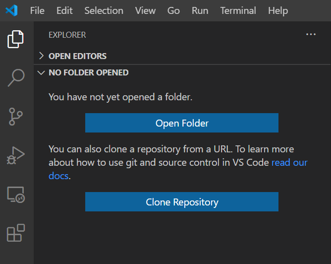
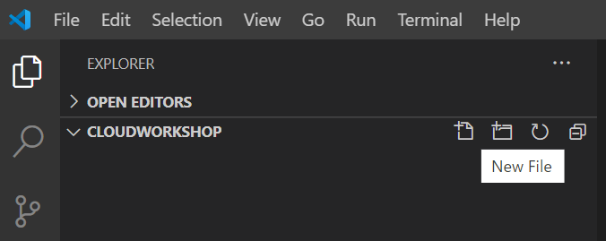
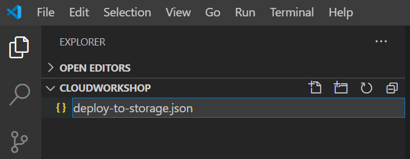
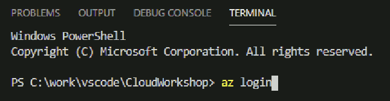
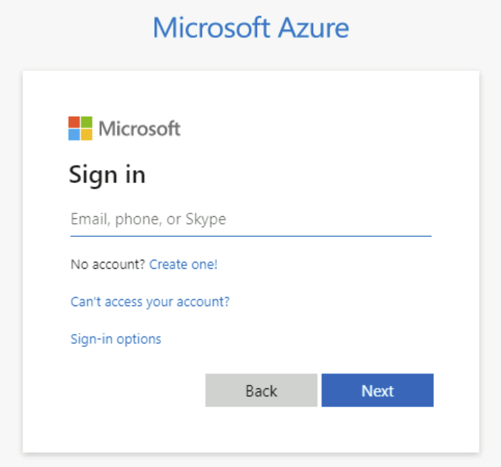
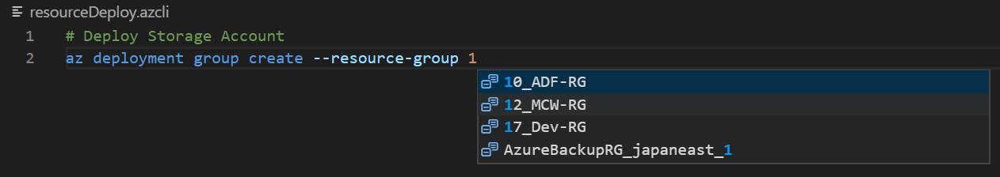
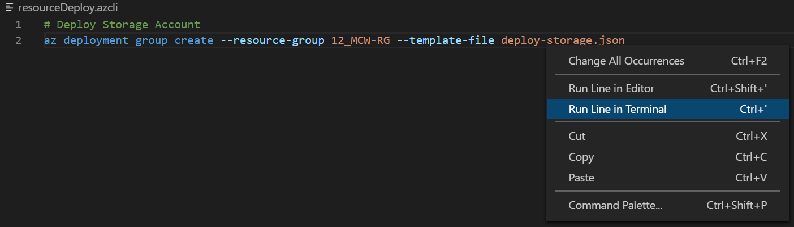

Deploy Azure Resources by using GitHub Actions  
Hands-on lab  
Oct 2020

 

**Contents**
- [Exercise 1: Azure Resource Manager テンプレートの使用](#exercise-1-azure-resource-manager-テンプレートの使用)
- [Exercise 2: 手動トリガーのワークフローによるサーバーの展開](#exercise-2-手動トリガーのワークフローによるサーバーの展開)
- [Exercise 3: イベント トリガーのワークフローによるサーバーの展開](#exercise-3-イベント-トリガーのワークフローによるサーバーの展開)

 

# **Deploying to Azure hands-on training**

 

## **要約および学習目標**
Azure Resource Manager (ARM) テンプレートを使用することで Azure リソースに IaC (Infrastructure as Code) を提供することができます。Azure リソースの構成をコード化することにより反復可能な一貫性のある展開が可能になり、且つリポジトリにコードを保存することで変更履歴の管理も容易に行えます。GitHub リポジトリでは、GitHub Actions を使用することでワークフローを定義し、CI/CD を実現することが可能です。  
本ワークショップでは、GitHub を使用した ARM テンプレートの管理、ならびに GitHub Actions の Azure CLI アクションによる Azure Resource Manager (ARM) テンプレートのデプロイ方法を学習します。  

### **ワークショップで使用する環境**

 

### **事前準備**
- 環境の準備
  -  Visual Studio Code のインストール  
  <https://azure.microsoft.com/ja-jp/products/visual-studio-code/>
  - Azure Resource Manager (ARM) Tools のインストール  
  <https://marketplace.visualstudio.com/items?itemName=msazurermtools.azurerm-vscode-tools>
  - Japanese Language Pack for Visual Studio Code のインストール（日本語化する場合）  
  <https://marketplace.visualstudio.com/items?itemName=MS-CEINTL.vscode-language-pack-ja>
  - Git のインストール  
  <https://git-scm.com/>
  - Azure CLI のインストール  
  <https://docs.microsoft.com/ja-jp/cli/azure/install-azure-cli>
  - GitHub アカウントの作成  
  <https://github.com/>
- ワークショップで使用するリポジトリを fork
  - ワークショップで使用するリポジトリ  
  <https://github.com/hiroyay-ms/Deploying-to-Azure-Hands-on-Lab>
  - リポジトリをフォークする  
  <https://docs.github.com/ja/free-pro-team@latest/github/getting-started-with-github/fork-a-repo>
- Azure ポータルへのアクセス確認
  - Azure ポータル  
  <https://portal.azure.com>

 

# **Exercise 1: Azure Resource Manager テンプレートの使用**
Azure Resource Manager (ARM) テンプレートを作成し、Azure リソースを展開します。  
ARM テンプレートは、複数リソースを展開する際の再利用性を高めるために入力パラメーターを別ファイルで管理できるようにします。

## **Task 1**: Azure Resource Manager テンプレートによるストレージ アカウントの展開

 

### リソース グループの作成
1. ブラウザを起動し Azure Portal（<https://portal.azure.com>）へアクセス

2. "**+リソースの作成**" をクリック

    

3. 新規リソースの作成画面の検索ボックスに "**resource group**" と入力

    表示される候補から "**Resource Group**" を選択

    

4. "**作成**" をクリック

    

5. "**リソース グループ名**" を入力し、"**リージョン**" を選択

    "**確認および作成**" をクリック

    

6. 事前検証に成功したことを確認し "**作成**" をクリック

7. リソース グループが正常に作成されることを確認

    

### Visual Studio Code を使用した Azure Resource Manager テンプレートの作成
1. Explorer（画面左の一番上のアイコン）の "**Open Folder**" をクリック

    

2. 任意の作業フォルダを選択し "**フォルダーの選択**" をクリック

      

    画面左の Explorer に選択したフォルダが表示
3. "**New File**" アイコンをクリック

    

4. "**deploy-storage.json**" と入力し、Enter キーを押下

      

    エディターで作成した .json ファイルが表示

5. "**arm**" と入力すると候補が表示されるので "**arm!**" を選択

    

    ARM テンプレートの雛形が展開され表示

    

6. resources 要素内で改行し "**storage**" と入力

    表示される候補より "**arm-storage**" を選択

    

    ストレージ アカウントを展開するための雛形が挿入

    

7. テンプレートを編集

    

    - name: （任意）3 ～ 24 文字で英語の小文字と数字の組み合わせ

    - tags: 複数指定可能

    - location: **[resourceGroup().location]**　展開するリソース グループと同じリージョンに配置

    - kind: **StorageV2** (Storage, StorageV2, BlobStorage, FileStorage, BlockBlobStorage)

    - sku:

      - name: **Standard_LRS**

        (Standard_LRS, Standard_GRS, Standard_RAGRS, Standard_ZRS, Standard_GZRS, Standard_RAGZRS, Premium_LRS, Premium_ZRS)

      - tier: **Standard**　(Standard or Premium)

8. "**File**" メニューの "**Save**" をクリックし、ファイルを保存

### Azure Resource Manager テンプレートと Azure CLI による展開
1. "**Terminal**" メニューの "**New Terminal**" をクリック

    

2. ターミナル ウィンドウで "**az login**" コマンドを実行

    

3. ブラウザが起動し、サインイン情報の入力を要求

    

    アカウント名、パスワードを入力し、サインインを実行

    サインインが正常に完了したことを確認したところで、ブラウザを閉じ、Visual Studio Code を表示

4. 以下のコマンドを実行

    **az deployment group create --resource-group {resourceGroup} --template-file deploy-storage.json**

    ＊{resourceGroup} には前の手順で作成したリソース グループ名を指定

5. 実行が完了したことを確認し、Azure ポータルで作成したストレージ アカウントを確認

    

    ストレージ名やレプリケーション、アカウントの種類、タグが指定した設定で作成されていることを確認

 

## **Task 2**: パラメーター ファイルを使用したストレージ アカウントの展開

 

## **criteria**
- 作成した ARM テンプレートを利用しストレージ アカウントを展開できること
- ARM テンプレートのパラメーターはパラメーター ファイルで指定すること

 

### **参考情報**
- **ARM テンプレートの構造と構文について**  
<https://docs.microsoft.com/ja-jp/azure/azure-resource-manager/templates/template-syntax>
- **Visual Studio Code を使用して ARM テンプレートを作成する**  
<https://docs.microsoft.com/ja-jp/azure/azure-resource-manager/templates/quickstart-create-templates-use-visual-studio-code?tabs=CLI>
- **Resource Manager パラメーター ファイルを作成する**  
<https://docs.microsoft.com/ja-jp/azure/azure-resource-manager/templates/parameter-files>
- **ARM テンプレートと Azure CLI でリソースをデプロイする**  
<https://docs.microsoft.com/ja-jp/azure/azure-resource-manager/templates/deploy-cli>
- **Microsoft.Storage storageAccounts template reference**  
<https://docs.microsoft.com/en-us/azure/templates/microsoft.storage/2019-06-01/storageaccounts>

 

- Azure CLI Tools
Visual Studio Code の拡張機能  
<https://marketplace.visualstudio.com/items?itemName=ms-vscode.azurecli>
    - .azcli ファイルを作成することで Azure CLI の IntelliSense が利用可能

      

    - Azure にサインイン済みであればリソース グループ名の候補も表示

      
    
    - 右クリックで表示されるメニューよりコマンドを実行

      

 

# **Exercise 2: 手動トリガーのワークフローによるサーバーの展開**
Azure Resource Manager (ARM) テンプレートが保存されている GitHub リポジトリにワークフローを作成し、既存の仮想ネットワークに仮想マシンを展開します。

## **Task 1**: サーバーの展開に使用する資格情報の構成
- Azure リソースを展開するために必要な権限が付与されたサービス プリンシパルの作成
- GitHub シークレットとして資格情報を保存

## **Task 2**: ワークフローを作成し仮想マシンを展開
- 仮想マシンの展開に使用する ARM テンプレートのパラメーター ファイルを作成
- GitHub Actions のワークフローを作成

 

## **criteria**
- GitHub Actions で仮想マシンを展開するワークフローが作成されていること
- ワークフローは手動で実行でき、実行時に Resource Group 名を指定できること

 

### **参考情報**
- **GitHub Actions のワークフロー構文**  
<https://docs.github.com/ja/free-pro-team@latest/actions/reference/workflow-syntax-for-github-actions>
- **ワークフローをトリガーするイベント**  
<https://docs.github.com/ja/free-pro-team@latest/actions/reference/events-that-trigger-workflows>
- **GitHub Actions のメタデータ構文**  
<https://docs.github.com/ja/free-pro-team@latest/actions/creating-actions/metadata-syntax-for-github-actions>
- **GitHub Actions を使用した Azure Resource Manager テンプレートのデプロイ**  
<https://docs.microsoft.com/ja-jp/azure/azure-resource-manager/templates/deploy-github-actions>

- **Create an Azure service principal with th Azure CLI**  
<https://docs.microsoft.com/ja-jp/cli/azure/create-an-azure-service-principal-azure-cli>
- **Encrypted secrets**  
<https://docs.github.com/ja/free-pro-team@latest/actions/reference/encrypted-secrets>
- **Azure CLI Action**  
<https://github.com/marketplace/actions/azure-cli-action>

 

# **Exercise 3: イベント トリガーのワークフローによるサーバーの展開**
Azure Resource Manager (ARM) テンプレートが保存されている GitHub リポジトリにワークフローを作成し、Azure リソースを展開します。  
展開する Azure リソースは、「リソース グループ」「仮想ネットワーク」「仮想マシン」の3種類です。  
Azure リソースを展開するデータセンターは既存システムが展開されているペアのリージョンを選択してください。  
GitHub Actions のワークフローは、main ブランチへの push 時に実行されます。  
main ブランチを保護は保護され、Pull Request が Merge される前に2人の Reviewer から承認を得るようにします。

## **Task 1**: リポジトリの設定
- ブランチ保護を設定し、Pull Request 時のレビューを必須に設定

## **Task 2**: ワークフローを作成し、Azure リソースを展開
- 仮想マシンの展開に使用する ARM テンプレートのパラメーター ファイルを作成
- GitHub Actions のワークフローを作成

 

## **criteria**
- GitHub Actions で Pull Request をトリガーにしたワークフローが作成されていること
- ワークフローは ARM テンプレートのパラメーター ファイルの変更がマージされた際に実行されること
- main ブランチが保護されていること
- Pull Request 時に変更をレビューできること
- SQL Server のデータベースが指定した時間で復元されていること

 

### **参考情報**
- **ワークフローをトリガーするイベント**  
<https://docs.github.com/ja/free-pro-team@latest/actions/reference/events-that-trigger-workflows>
- **保護されたブランチの設定**  
<https://docs.github.com/ja/free-pro-team@latest/github/administering-a-repository/configuring-protected-branches>
- **プルリクエスト時の必須レビューを有効にする**  
<https://docs.github.com/ja/free-pro-team@latest/github/administering-a-repository/enabling-required-reviews-for-pull-requests>
- **Azure のペアになっているリージョン** 
<https://docs.microsoft.com/ja-jp/azure/best-practices-availability-paired-regions>
- **Azure VM における SQL Server のバックアップと復元**  
<https://docs.microsoft.com/ja-jp/azure/azure-sql/virtual-machines/windows/backup-restore>
- **Azure VM 上の SQL Server データベースを復元する**  
<https://docs.microsoft.com/ja-jp/azure/backup/restore-sql-database-azure-vm>