Deploy Azure Resources by using GitHub Actions  
Hands-on lab  
Nov 2020

<br />

**Contents**
- [Exercise 1: Azure Resource Manager テンプレートの使用](#exercise-1-azure-resource-manager-テンプレートの使用)
- [Exercise 2: 手動トリガーのワークフローによるサーバーの展開](#exercise-2-手動トリガーのワークフローによるサーバーの展開)
- [Exercise 3: イベント トリガーのワークフローによるサーバーの展開](#exercise-3-イベント-トリガーのワークフローによるサーバーの展開)

<br />

# **Deploying to Azure hands-on training**


<br />

## **要約および学習目標**
Azure Resource Manager (ARM) テンプレートを使用することで Azure リソースに IaC (Infrastructure as Code) を提供することができます。Azure リソースの構成をコード化することにより反復可能な一貫性のある展開が可能になり、且つリポジトリにコードを保存することで変更履歴の管理も容易に行えます。GitHub リポジトリでは、GitHub Actions を使用することでワークフローを定義し、CI/CD を実現することが可能です。  
本ワークショップでは、GitHub を使用した ARM テンプレートの管理、ならびに GitHub Actions の Azure CLI アクションによる Azure Resource Manager (ARM) テンプレートのデプロイ方法を学習します。  

### **事前準備**

- ローカル環境
  -  Visual Studio Code のインストール  
  <https://azure.microsoft.com/ja-jp/products/visual-studio-code/>
  - Azure Resource Manager (ARM) Tools のインストール  
  <https://marketplace.visualstudio.com/items?itemName=msazurermtools.azurerm-vscode-tools>
  - Japanese Language Pack for Visual Studio Code のインストール（日本語化する場合）  
  <https://marketplace.visualstudio.com/items?itemName=MS-CEINTL.vscode-language-pack-ja>
  - Git のインストール  
  <https://git-scm.com/>
  - Azure CLI のインストール  
  <https://docs.microsoft.com/ja-jp/cli/azure/install-azure-cli>
- GitHub
  - アカウントの作成  
  <https://github.com/>
- Azure
  - Azure ポータルへのアクセス  
  <https://portal.azure.com>

<br />

# **Exercise 1: Azure Resource Manager テンプレートの使用**
Azure Resource Manager (ARM) テンプレートを作成し、Azure リソースを展開します。  
ARM テンプレートは、複数リソースを展開する際の再利用性を高めるために入力パラメーターを別ファイルで管理できるようにします。

## **Task 1**: Azure Resource Manager テンプレートによるストレージ アカウントの展開

### リソース グループの作成
1. ブラウザを起動し Azure Portal（<https://portal.azure.com>）へアクセス

2. "**+リソースの作成**" をクリック

    

3. 新規リソースの作成画面の検索ボックスに "**resource group**" と入力

    表示される候補から "**Resource Group**" を選択

    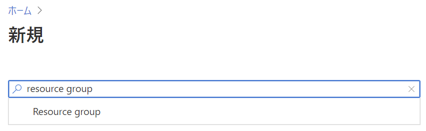

4. "**作成**" をクリック

    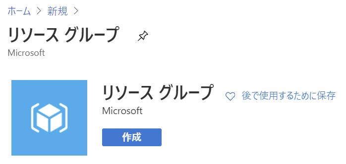

5. "**リソース グループ名**" を入力し、"**リージョン**" を選択

    "**確認および作成**" をクリック

    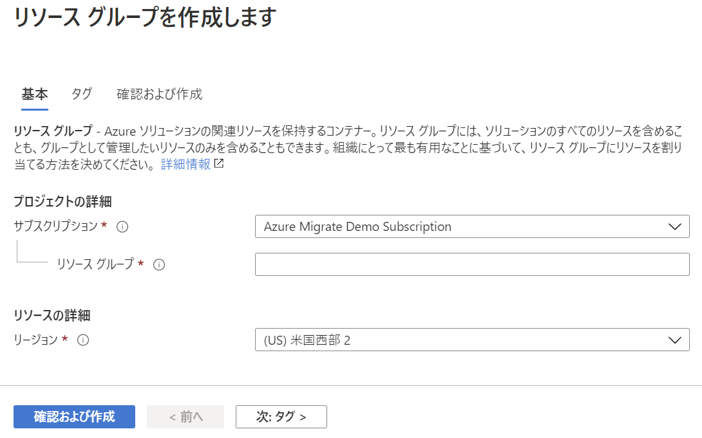

6. 事前検証に成功したことを確認し "**作成**" をクリック

7. リソース グループが正常に作成されることを確認

    

<br />

### Visual Studio Code を使用した Azure Resource Manager テンプレートの作成
1. Explorer（画面左の一番上のアイコン）の "**Open Folder**" をクリック

    

2. 任意の作業フォルダを選択し "**フォルダーの選択**" をクリック

    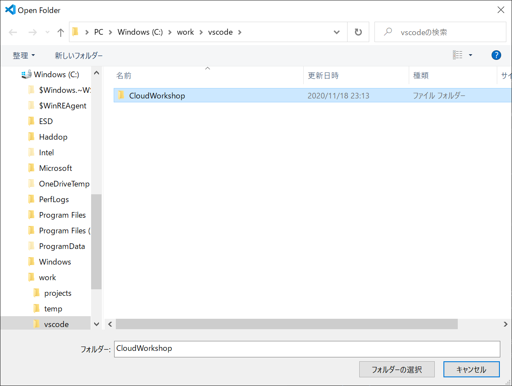  

    画面左の Explorer に選択したフォルダが表示
3. "**New File**" アイコンをクリック

    

4. "**deploy-storage.json**" と入力し、Enter キーを押下

    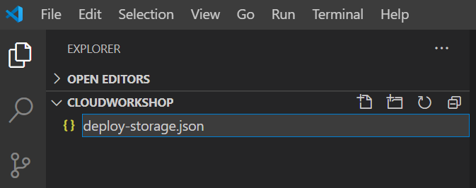  

    エディターで作成した .json ファイルが表示

5. "**arm**" と入力すると候補が表示されるので "**arm!**" を選択

    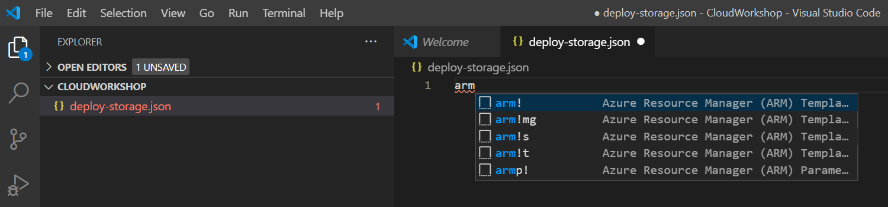

    ARM テンプレートの雛形が展開され表示

    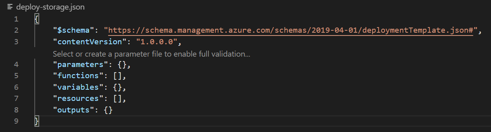

6. resources セクション内で改行し "**storage**" と入力

    表示される候補より "**arm-storage**" を選択

    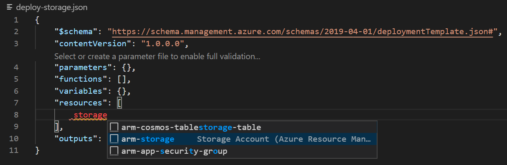

    ストレージ アカウントを展開するための雛形が挿入

    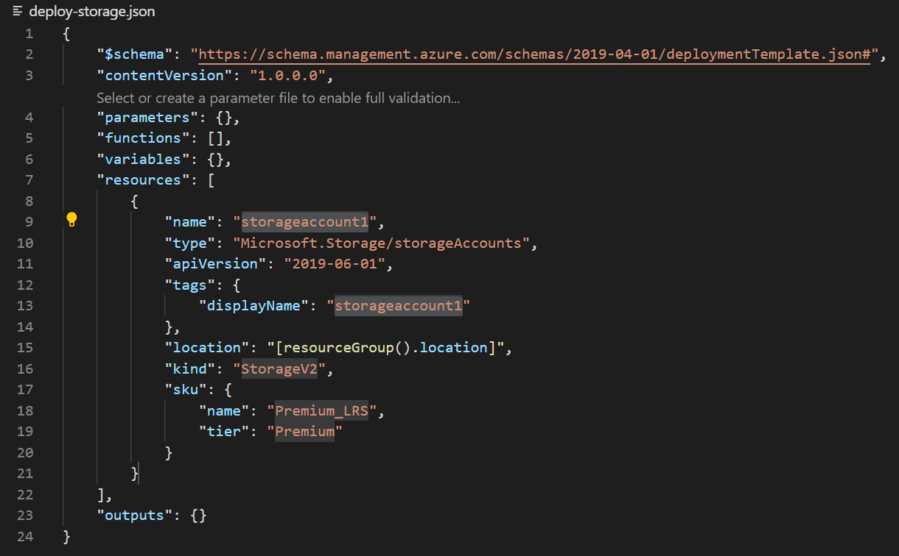

7. テンプレートを編集

    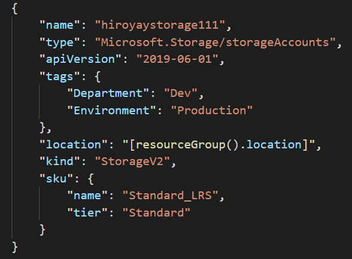

    - name: （任意）3 ～ 24 文字で英語の小文字と数字の組み合わせ

    - tags: 複数指定可能

    - location: **[resourceGroup().location]**　展開するリソース グループと同じリージョンに配置

    - kind: **StorageV2** (Storage, StorageV2, BlobStorage, FileStorage, BlockBlobStorage)

    - sku:

      - name: **Standard_LRS**

        (Standard_LRS, Standard_GRS, Standard_RAGRS, Standard_ZRS, Standard_GZRS, Standard_RAGZRS, Premium_LRS, Premium_ZRS)

      - tier: **Standard**　(Standard or Premium)

8. "**File**" メニューの "**Save**" をクリックし、ファイルを保存

<br />

### Azure Resource Manager テンプレートと Azure CLI による展開
1. "**Terminal**" メニューの "**New Terminal**" をクリック

    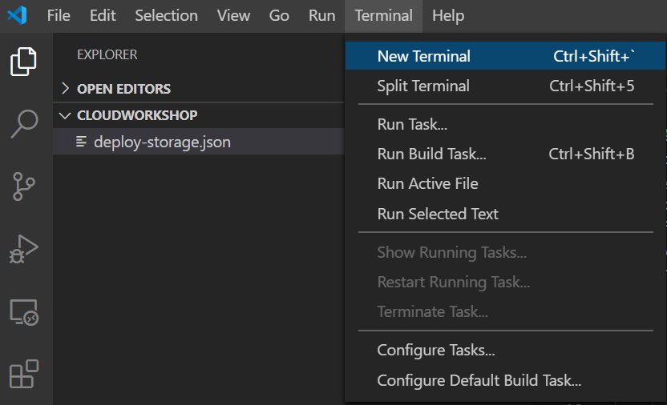

2. ターミナル ウィンドウで Azure へのログイン コマンドを実行


    ```Azure CLI
    az login
    ```

    

3. ブラウザが起動し、サインイン情報の入力を要求

    

    アカウント名、パスワードを入力し、サインインを実行

    サインインが正常に完了したことを確認したところで、ブラウザを閉じ、Visual Studio Code を表示

4. 以下のコマンドを実行

    ```Azure CLI
    az deployment group create --resource-group {resourceGroup} --template-file deploy-storage.json
    ```

    ＊**{resourceGroup}** には前の手順で作成したリソース グループ名を指定

5. 実行が完了したことを確認し、Azure ポータルで作成したストレージ アカウントを確認

    

    ストレージ名やレプリケーション、アカウントの種類、タグが指定した設定で作成されていることを確認

<br />

### リソース作成時に指定する項目のパラメーター化

1. parameters セクションにパラメーターを追加

    

    - **type**: 必須、パラメーター値の型  
    string, securestring, int, bool, object, secureObject, array

    - **defaultValue**: 既定値

    - **allowedValues**: パラメーターに指定できる値の配列

    - **description**: ポータルを通じてユーザーに表示されるパラメーターの説明

2. variables セクションでテンプレート内で使用する変数を定義

    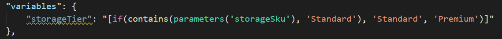

    ＊ARM テンプレート内では関数の使用が可能

    ＊storageSku パラメーターに Standard 文字列が含まれている場合は Standard を、含まれない場合は Premium を格納

3. resources セクションでパラメーター、変数を指定

    

    ＊パラメーターや変数の入力時も IntelliSense で候補を表示
    
    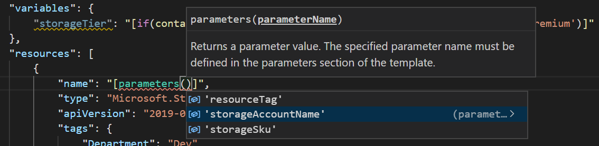

<br />

4. "**File**" メニューの "**Save**" をクリックし、ファイルを保存

<br />

### Azure Resource Manager テンプレートと Azure ポータルによる展開

1. ブラウザーで [Azure ポータル](https://portal.azure.com) を表示

2. トップページの検索バーに "**カスタム テンプレート**" と入力

    表示される候補より "**カスタム テンプレートのデプロイ**" を選択

    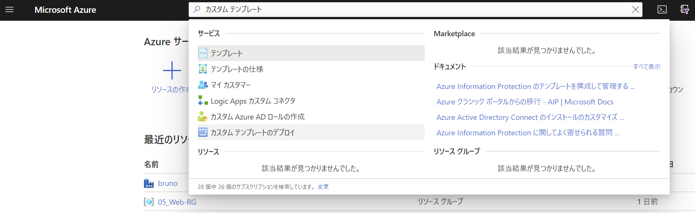

3. カスタム テンプレートからのデプロイ画面が表示、**エディターで独自のテンプレートを作成する** をクリック

    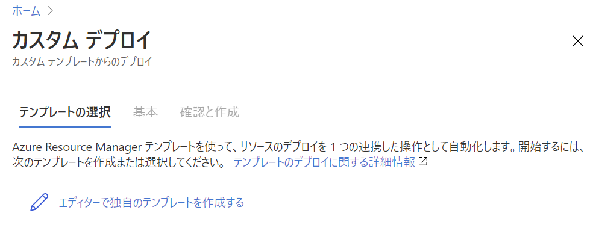

4. テンプレートの編集画面が表示、"**ファイルの読み込み**" をクリックし、作成した ARM テンプレートを選択

    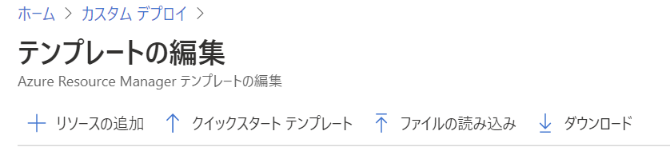

5. エディターに作成したファイルの内容が表示、"**保存**" をクリック

    

6. ストレージ アカウント名、レプリケーションの種類、タグを指定し "**確認および作成**" をクリック

    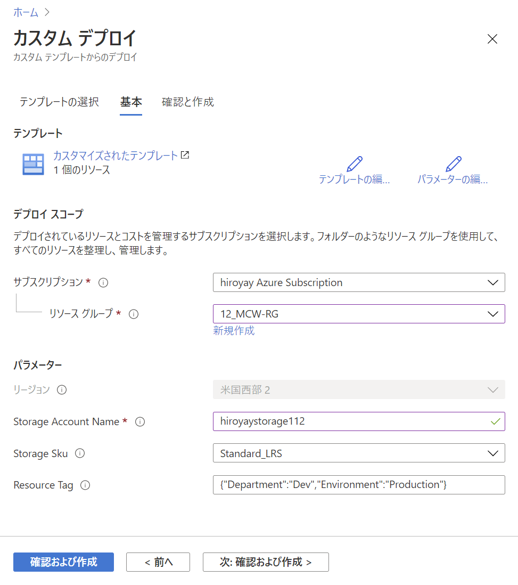

    ＊パラメーターの説明として description に記載した内容が表示

    

    ＊レプリケーションの種類は許可した値のみ選択可

    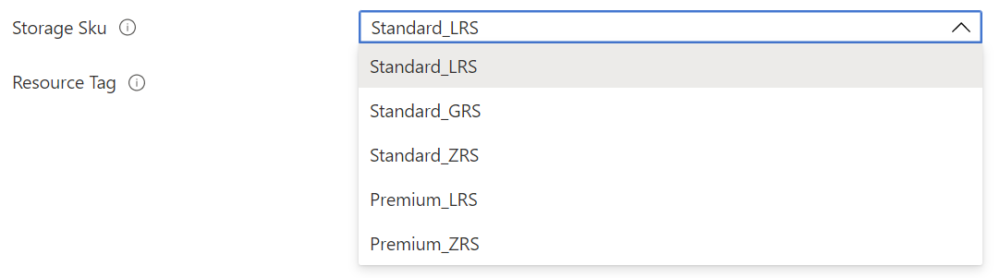

7. 検証に成功したことを確認し "**作成**" をクリック

8. 展開が終了後、リソースに移動し内容を確認

    

<br />

## **Task 2**: パラメーター ファイルを使用したストレージ アカウントの展開

### Visual Studio Code を使用したパラメーター ファイルの作成

1. Visual Studio Code で作成した ARM テンプレートを表示

2. parameters セクションの上の "**Select or create parameter file to enable full validation...**" をクリック

    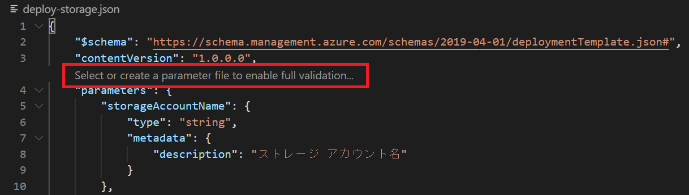

3. 新規にテンプレートで指定されたすべてのパラメーターを含むパラメーター ファイルを作成

    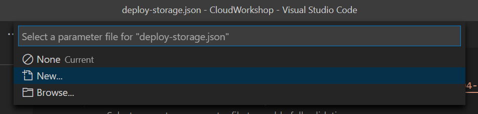

    ＊ "**New**" を選択

    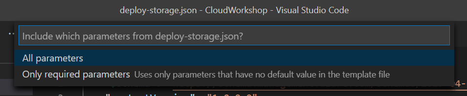

    ＊ "**All parameters**" を選択

    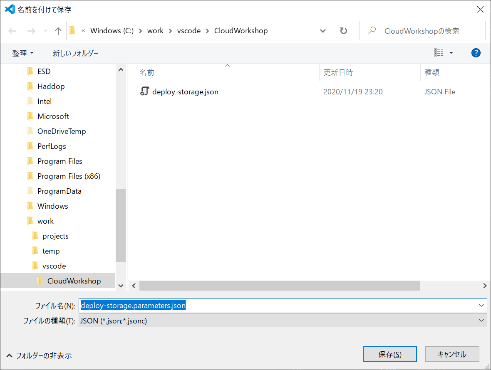

    ＊ファイルの保存場所を選択し "**保存**" をクリック

4. 作成したパラメーター ファイルが表示

    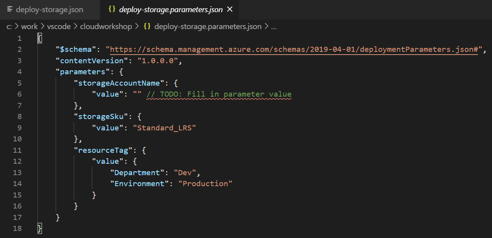

5. パラメーターに値を指定

    

    ＊// TODO: Fill in parameter value のメッセージは削除

    ＊storageAccountName は 3 ～ 24 の英語小文字と数字で一意となる名前にすること

6. "**File**" メニューの "**Save**" にてファイルを保存

7. ARM テンプレート ファイルを表示

    

    ＊作成したパラメーター ファイルとマッピングされ指定した値の確認が可能

<br />

### Azure CLI による展開

1. "**Terminal**" メニューの "**New Terminal**" で統合ターミナルを表示

2. 以下のコマンドを実行

   ```Azure CLI
   az deployment group create --resource-group {resourceGroup} --template-file deploy-storage.json --parameters deploy-storage.parameters.json
   ```

   ＊１行で入力

   ＊{resourceGroup} は先の手順で作成したリソース グループ名を指定

3. ブラウザで [Azure Portal](https://portal.azure.co) を開き、作成したリソースを確認

<br />

### **参考情報**
- **ARM テンプレートの構造と構文について**  
<https://docs.microsoft.com/ja-jp/azure/azure-resource-manager/templates/template-syntax>
- **Visual Studio Code を使用して ARM テンプレートを作成する**  
<https://docs.microsoft.com/ja-jp/azure/azure-resource-manager/templates/quickstart-create-templates-use-visual-studio-code?tabs=CLI>
- **Resource Manager パラメーター ファイルを作成する**  
<https://docs.microsoft.com/ja-jp/azure/azure-resource-manager/templates/parameter-files>
- **ARM テンプレートと Azure CLI でリソースをデプロイする**  
<https://docs.microsoft.com/ja-jp/azure/azure-resource-manager/templates/deploy-cli>
- **Microsoft.Storage storageAccounts template reference**  
<https://docs.microsoft.com/en-us/azure/templates/microsoft.storage/2019-06-01/storageaccounts>
- **ARM テンプレート関数**  
<https://docs.microsoft.com/ja-jp/azure/azure-resource-manager/templates/template-functions>

<br />

- Azure CLI Tools
Visual Studio Code の拡張機能  
<https://marketplace.visualstudio.com/items?itemName=ms-vscode.azurecli>
    - .azcli ファイルを作成することで Azure CLI の IntelliSense が利用可能

      

    - Azure にサインイン済みであればリソース グループ名の候補も表示

      
    
    - 右クリックで表示されるメニューよりコマンドを実行

      

<br />

# **Exercise 2: 手動トリガーのワークフローによるサーバーの展開**
Azure Resource Manager (ARM) テンプレートが保存されている GitHub リポジトリにワークフローを作成し、既存の仮想ネットワークに仮想マシンを展開します。

## **Task 1**: GitHub リポジトリのフォーク
- ワークショップのリポジトリを使用する GitHub アカウントにフォーク

  - ブラウザでワークショップのリポジトリを表示  
  <https://github.com/hiroyay-ms/Deploying-to-Azure-Hands-on-Lab>


  - ページ右上の "**fork**" をクリック

    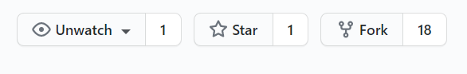

## **Task 2**: サーバーの展開に使用する資格情報の構成
- Azure リソースを展開するために必要な権限が付与されたサービス プリンシパルの作成

  - Azure CLI で "**az ad sp create-for-rbac**" コマンドを使用して作成

    ```
    az ad sp create-for-rbac --name http://{myApp} --role Contributor --scopes /subscriptions/{subscriptonId}/resourceGroups/{resourceGroup} --sdk-auth
    ```

    ＊{myApp}: 任意の名前

    ＊{subscriptionId}: サブスクリプションの GUID（ Azure ポータルから取得）

    ＊{resourceGroup}: リソースの展開先となるリソース グループ名を指定

  - コマンド実行後に出力される JSON 情報をコピー
<br />

- GitHub シークレットとして資格情報を保存

  - フォークしたリポジトリの "**Settings**" タブを選択

    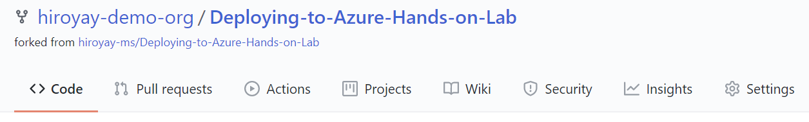

  - "**Secrets**" メニューの "**New repository secret**" をクリック

  - 先の手順でコピーした JSON を貼り付け "**Add secret**" をクリック

    

    ＊Name: **AZURE_CREDENTIALS**

  - シークレットの登録が完了

    

<br />

## **Task 3**: ワークフローの作成と実行の確認
### GitHub Actions のワークフローを作成

  - "**Actions**" タブへ移動し、ワークフローを作成

    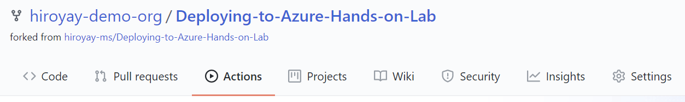

    <br />

    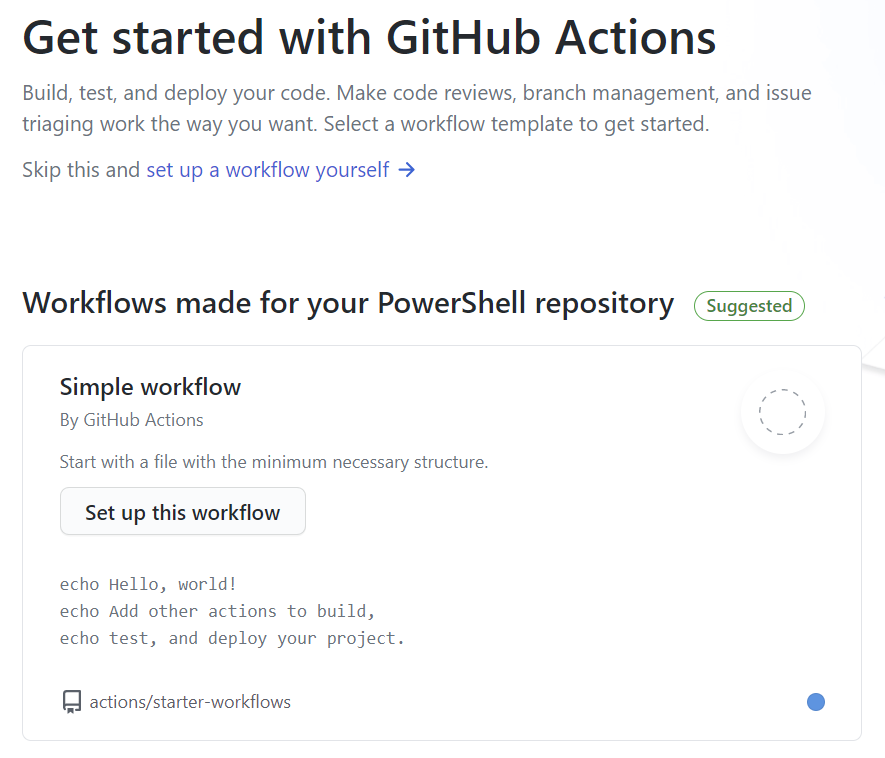

    ＊"**Set up this workflow**" をクリック

  - ワークフロー ファイル名を変更

    

  - ワークフロー名を変更

    ```yml
    name: Deploy Virtual Machine
    ```

    - **name**: 任意のワークフロー名を入力

  - ワークフローを手動起動でき、且つ起動時にパラメーター入力できるよう設定

    ```yml
    on: 
      # 手動ワークフロー トリガー
      workflow_dispatch:
        # ワークフロー実行時に使用するパラメーターを定義
        inputs:
          # パラメーター名
          resourceGroupName:
            # ワークフロー実行時に画面に表示される名前
            description: Resource Group Name
            # 入力を必須に指定
            required: true
    ```

    - コード入力時に入力候補が表示

      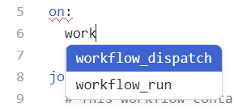

  - ワークフローで実行するジョブを定義

    ```yml
    jobs:
      # ジョブの名前
      deploy-virtual-machine:
        # ワーフローの実行環境の指定
        runs-on: ubuntu-latest

        steps:
          # コードをチェックアウト
          - uses: actions/checkout@v2

          # スクリプトの実行（画面に指定したパラメーターの値を表示）
          - name: Run a one-line script
            run: echo Hello, ${{ github.event.inputs.resourceGroupName }}
    ```

  - 作成したワークフローを保存

    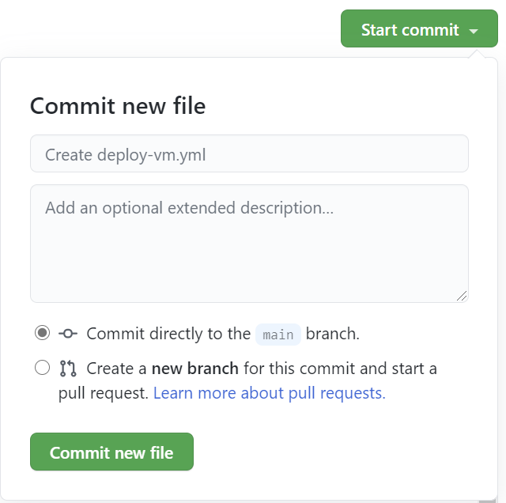

    - .yml ファイルはリポジトリ内の **.github/workflow** に保存

<br />

### ワークフローの実行

  - **Actions** タブへ移動し、実行するワークフローを選択

    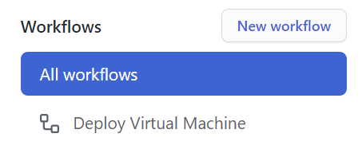

  - **Run Workflow** をクリック

    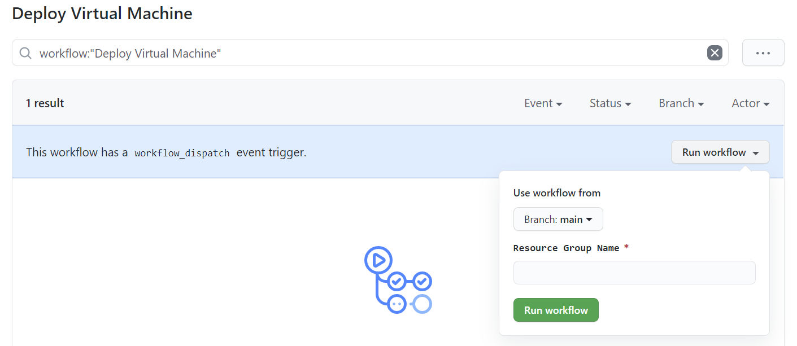

    - **Use workflow from**: ブランチを選択

    - **Resource Group Name**: 指定した入力パラメーター

  - ワークフローの実行が開始

    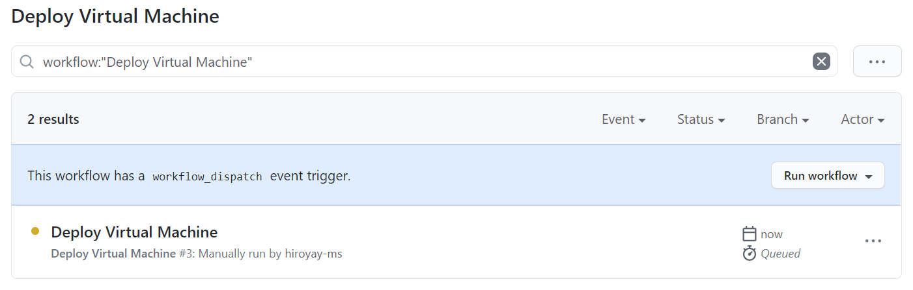

    - クリックすると詳細な実行内容を確認可

      

      - **Run a one-line script** を展開すると、コマンドの実行状況を確認可  
      入力したリソースグループ名が表示されることを確認

<br />

## **Task 4**: ワークフローを更新し仮想マシンを展開
### 仮想マシンの展開に使用する ARM テンプレートのパラメーター ファイルを作成

  - ワークショップ リポジトリのクローン

    - リポジトリのページから clone URL をコピー

      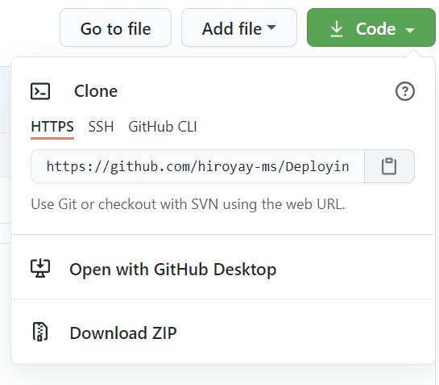

    - Visual Studio Code の統合ターミナルで "**git clone**" コマンドを実行

      ```
      git clone https://github.com/{GitHub Account}/Deploying-to-Azure-Hands-on-Lab.git
      ```

      ＊コマンド実行前にリポジトリのクローン先となるディレクトリへ移動

      ＊{GitHub Account} にはリポジトリをフォークしたアカウント名が表示

    - Git の設定

       ```
       git config --local user.email "{email}"
       git config --local user.name "{name}"
       ```

       ＊{email}, {name} には、GitHub アカウントの情報を指定

      ＊設定後、クローンしたディレクトリへ移動し "**code .**" コマンドを実行（新しいウィンドウが起動）
    
    - 画面左下からブランチの切替が可

        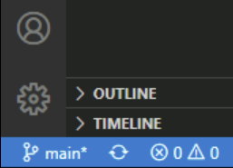

        ＊"**main**" のクリックで切替

  - "**deploy-vm-as-domain-member.json**" からパラメーター ファイルを作成

      - "**Select or create a parameter file to enable full validation...**" をクリックしファイルを作成

      - パラメーターに値を入力し保存

        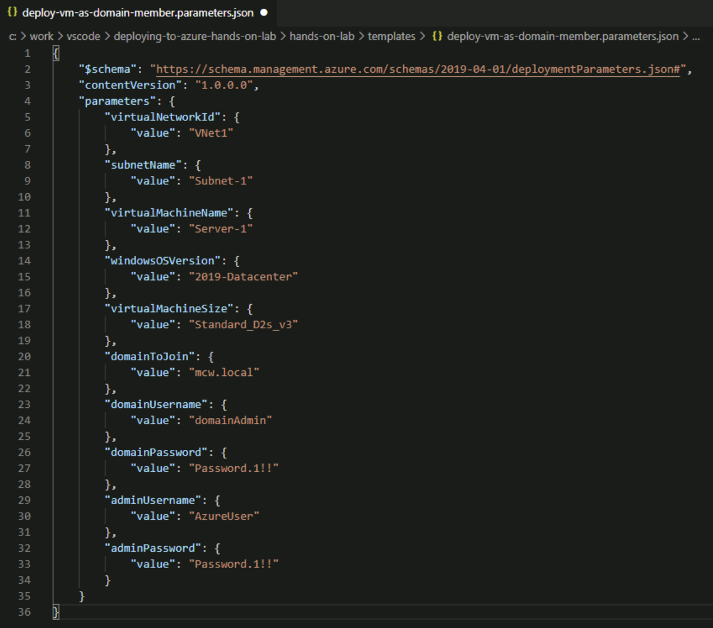

        ＊// TODO: Fill in parameter value のメッセージは削除

        ＊展開先の仮想ネットワークやサブネットの情報はポータルから取得

        ＊サーバー名、OS などの情報は任意で指定可 ( デフォルトで記載される Web-SVR は利用せず必ず変更する )

        ＊参加ドメイン名及びドメインアドミンのユーザー名、パスワードは講師に確認
    
  - 変更内容をリポジトリにプッシュ

    - ローカル Git にコミット

      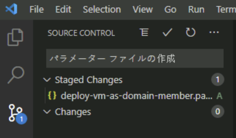

      ＊コミット時に変更内容をコメントに記述

      ＊ "**✓**" のクリックでコミットを実行

    - GitHub リポジトリへプッシュ

      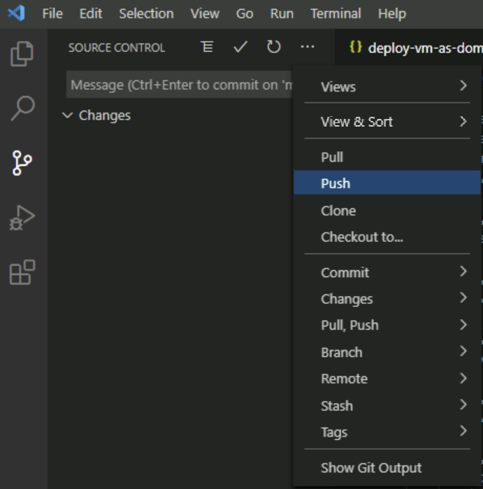

      ＊ "**...**" をクリックし、表示されるメニューより "**Push**" を選択

    - GitHub への認証

      - "**Sign in with your browser**" をクリック

        

      - ブラウザで資格情報を入力し認証を実行

        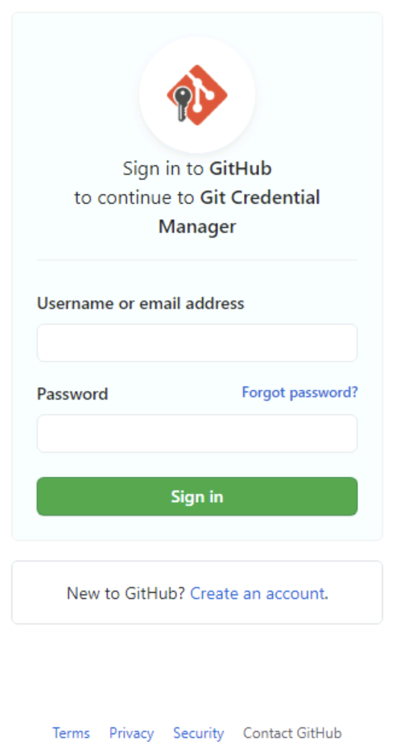

<br />

### ワークフローの更新（Azure CLI アクションで仮想マシンを展開）

  - ジョブの定義を変更

    ```yml
    jobs:
      # ジョブの名前はメンバーで重複しないように指定
      deploy-virtual-machine:
        runs-on: ubuntu-latest

        steps:
          - uses: actions/checkout@v2

          # 登録したシークレットで Azure へログイン
          - name: Login to Azure
            uses: azure/login@v1
            with:
              creds: ${{ secrets.AZURE_CREDENTIALS }}

          # Azure CLI を使用し ARM テンプレートから仮想マシンを展開
          - name: Deploy ARM Template
            uses: azure/CLI@v1
            with:
              # {parameter file} には先の手順で作成したパラメーター ファイル名を指定
              inlineScript: |
                az deployment group create --resource-group ${{ github.event.inputs.resourceGroupName }} --template-file ./Hands-on-Lab/templates/deploy-vm-as-domain-member.json --parameters {parameter file}

          # ログアウト
          - name: Azure logout
            run: |
              az logout
    ```

  - ワークフローを実行

    ＊事前に用意されたワークショップ環境のリソース グループを指定

  - [Azure ポータル](https://portal.azure.com) へ移動し作成した仮想マシンを確認
  
<br />

## **criteria**
- GitHub Actions で仮想マシンを展開するワークフローが作成されていること
- ワークフローは手動で実行でき、実行時に Resource Group 名を指定できること

<br />

### **参考情報**
- **リポジトリをフォークする**  
<https://docs.github.com/ja/free-pro-team@latest/github/getting-started-with-github/fork-a-repo>
- **GitHub Actions を使用した Azure Resource Manager テンプレートのデプロイ**  
<https://docs.microsoft.com/ja-jp/azure/azure-resource-manager/templates/deploy-github-actions>
- **Create an Azure service principal with th Azure CLI**  
<https://docs.microsoft.com/ja-jp/cli/azure/create-an-azure-service-principal-azure-cli>
- **Encrypted secrets**  
<https://docs.github.com/ja/free-pro-team@latest/actions/reference/encrypted-secrets>
- **リポジトリをクローンする**  
<https://docs.github.com/ja/free-pro-team@latest/github/creating-cloning-and-archiving-repositories/cloning-a-repository>
- **GitHub Actions のワークフロー構文**  
<https://docs.github.com/ja/free-pro-team@latest/actions/reference/workflow-syntax-for-github-actions>
- **ワークフローをトリガーするイベント**  
<https://docs.github.com/ja/free-pro-team@latest/actions/reference/events-that-trigger-workflows>
- **GitHub Actions のメタデータ構文**  
<https://docs.github.com/ja/free-pro-team@latest/actions/creating-actions/metadata-syntax-for-github-actions>
- **Azure CLI Action**  
<https://github.com/marketplace/actions/azure-cli-action>

<br />

# **Exercise 3: イベント トリガーのワークフローによるサーバーの展開**
Azure Resource Manager (ARM) テンプレートが保存されている GitHub リポジトリにワークフローを作成し、Azure リソースを展開します。  
展開する Azure リソースは、「リソース グループ」「仮想ネットワーク」「仮想マシン」の3種類です。  
Azure リソースを展開するデータセンターは既存システムが展開されているペアのリージョンを選択してください。  
GitHub Actions のワークフローは、main ブランチへの push 時に実行されます。  
main ブランチを保護は保護され、Pull Request が Merge される前に2人の Reviewer から承認を得るようにします。

## **Task 1**: リポジトリの設定
- ブランチ保護を設定し、Pull Request 時のレビューを必須に設定

## **Task 2**: ワークフローを作成し、Azure リソースを展開
- 仮想マシンの展開に使用する ARM テンプレートのパラメーター ファイルを作成
- GitHub Actions のワークフローを作成

<br />

## **criteria**
- GitHub Actions で Pull Request をトリガーにしたワークフローが作成されていること
- ワークフローは ARM テンプレートのパラメーター ファイルの変更がマージされた際に実行されること
- main ブランチが保護されていること
- Pull Request 時に変更をレビューできること
- SQL Server のデータベースが指定した時間で復元されていること

<br />

### **参考情報**
- **ワークフローをトリガーするイベント**  
<https://docs.github.com/ja/free-pro-team@latest/actions/reference/events-that-trigger-workflows>
- **保護されたブランチの設定**  
<https://docs.github.com/ja/free-pro-team@latest/github/administering-a-repository/configuring-protected-branches>
- **プルリクエスト時の必須レビューを有効にする**  
<https://docs.github.com/ja/free-pro-team@latest/github/administering-a-repository/enabling-required-reviews-for-pull-requests>
- **Azure のペアになっているリージョン** 
<https://docs.microsoft.com/ja-jp/azure/best-practices-availability-paired-regions>
- **Azure VM における SQL Server のバックアップと復元**  
<https://docs.microsoft.com/ja-jp/azure/azure-sql/virtual-machines/windows/backup-restore>
- **Azure VM 上の SQL Server データベースを復元する**  
<https://docs.microsoft.com/ja-jp/azure/backup/restore-sql-database-azure-vm>
